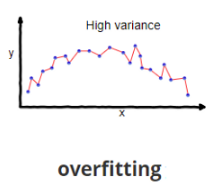

# Overfitting

Variância é uma medida de dispersão que mostra o quão distante cada valor desse conjunto está do valor central (média). Uma alta variância nos quer dizer que o nosso modelo está memorizando os valores do conjunto de treinamento, se tornando ineficaz para prever novos resultados. O problema de se ter uma variância alta é chamado de overfitting (sobreajuste).

Como dito anteriormente, _overfitting_ (sobre-ajuste ou super-ajuste) é quando temos uma variância alta. Uma das maneiras mais básicas que temos de reduzir esse problema é aumentando a quantidade de dados de treinamento, sendo que isso pode ser uma tarefa custosa dependendo do seu contexto. Outra maneira seria reduzir o tamanho da nossa rede, sendo que redes grandes têm o potencial de serem mais poderosas do que redes pequenas.

Felizmente existem as conhecidas **técnicas de regularização**, que servem justamente para diminuirmos esse nosso problema de _overfitting_.

## Técnicas de regularização

Abaixo coloco algumas técnicas de regularização que podem ser usadas.

### Regularização L2

Também conhecida como **decaimento de peso**, consiste em adicionar um termo extra (chamado de termo de regularização) à função de custo. Iremos chamar de $J_{0}$ a função de custo original e não regularizada. Dessa forma, adicionando o termo de regularização, temos:

Intuitivamente, o efeito da regularização é fazer com que a rede prefira aprender pequenos pesos, sendo todas as outras coisas iguais. Pesos grandes só serão permitidos se melhorarem consideravelmente a primeira parte da função de custo. Dito de outra forma, a regularização pode ser vista como uma forma de se comprometer entre encontrar pequenos pesos e minimizar a função de custo original. A importância relativa dos dois elementos do compromisso depende do valor de $\lambda$:

- Quando $\lambda$ é pequeno, preferimos minimizar a função de custo original;
- Quando $\lambda$ é grande, preferimos pesos pequenos.

### Regularização L1

Nesta abordagem, modificamos a função de custo não regularizada, adicionando a soma dos valores absolutos dos pesos:

Intuitivamente, isso é semelhante à regularização L2, penalizando grandes pesos e tendendo a fazer com que a rede prefira pequenos pesos. Naturalmente, o termo de regularização L1 não é o mesmo que o termo de regularização L2 e, portanto, não devemos esperar obter exatamente o mesmo comportamento.

Em ambas as expressões, o efeito da regularização é diminuir os pesos. Isso está de acordo com a nossa intuição de que ambos os tipos de regularização penalizam grandes pesos. Mas a maneira como os pesos diminuem é diferente. Na regularização L1, os pesos diminuem em uma quantidade constante para $0$. Na regularização L2, os pesos diminuem em um valor proporcional a $w$. E assim, quando um peso específico tem uma grande magnitude, a regularização L1 reduz o peso muito menos do que a regularização L2. Em contraste, quando $|w|$ é pequena, a regularização L1 reduz o peso muito mais do que a regularização L2. O resultado é que a regularização L1 tende a concentrar o peso da rede em um número relativamente pequeno de conexões de alta importância, enquanto os outros pesos são direcionados para zero.

### Dropout

Ao contrário da Regularização L1 e L2, o Dropout não depende da modificação da função de custo, em vez disso modificamos a própria rede.

1. Começamos por eliminar aleatoriamente (e temporariamente) alguns dos neurônios ocultos na rede, deixando os neurônios de entrada e saída intocados;
2. Nós encaminhamos para frente a entrada x através da rede modificada, e depois retropropagamos o resultado, também através da rede modificada;
3. Depois de fazer isso em um mini-lote de exemplos, atualizamos os pesos e vieses apropriados;
4. Em seguida, restauramos os neurônios removidos e repetimos todo o processo.

Ao repetir esse processo várias vezes, nossa rede aprenderá um conjunto de pesos e vieses. Naturalmente, esses pesos e vieses terão sido aprendidos sob condições em que parte dos neurônios ocultos foram descartados. Quando realmente executamos a rede completa, isso significa que mais neurônios ocultos estarão ativos. Para compensar isso, reduzimos pela metade os pesos que saem dos neurônios ocultos.

----------

Voltar para: [**Intro**](intro.md)
Seguir para: [**Underfitting**](underfitting.md)
