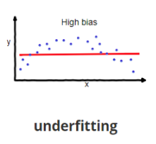

# Underfitting

Viés consiste em um erro sistemático, sendo uma distorção aleatória de uma estatística, como resultado do processo de amostragem. Consiste na diferença entre o valor médio de um estimador estatístico e o valor que pretende-se estimar. Isso ocorre quando os dados de treinamento diz X, porém o conjunto de dados de validação diz Y, ou seja, o conjunto de dados de treinamento não são uma boa representação da realidade ou eles refletem preconceitos existentes. O problema de se ter um viés alto é chamado de _underfitting_ (sub-ajuste).

----------

Voltar para: [**Overfitting**](overfitting.md)
